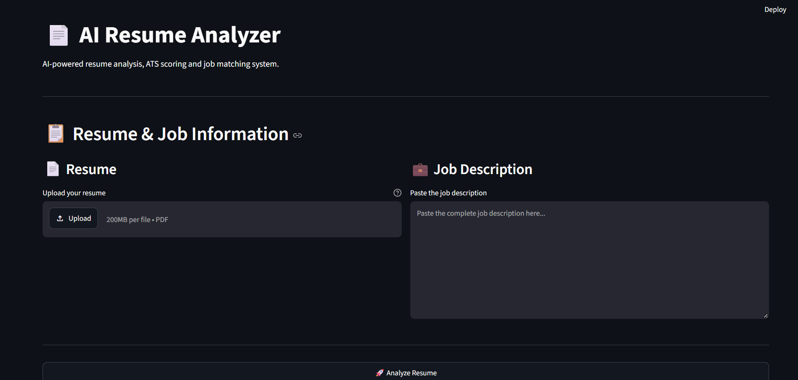
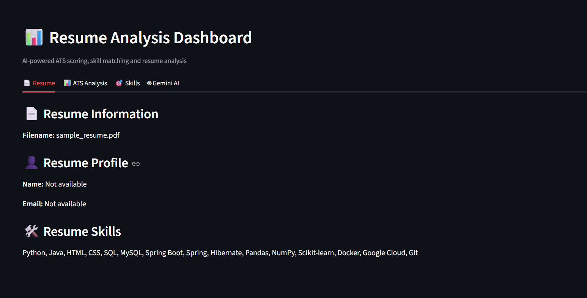
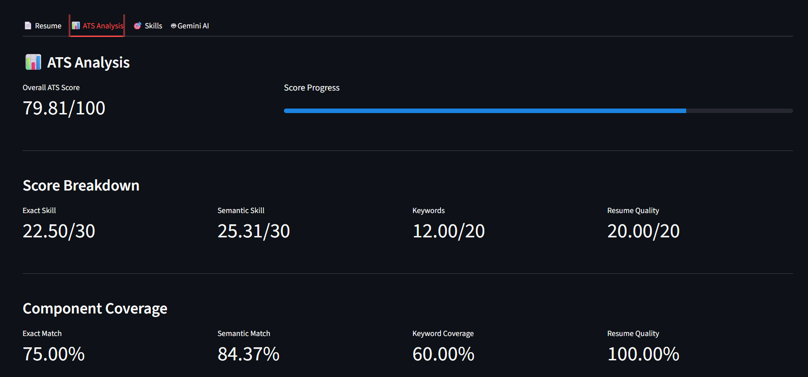
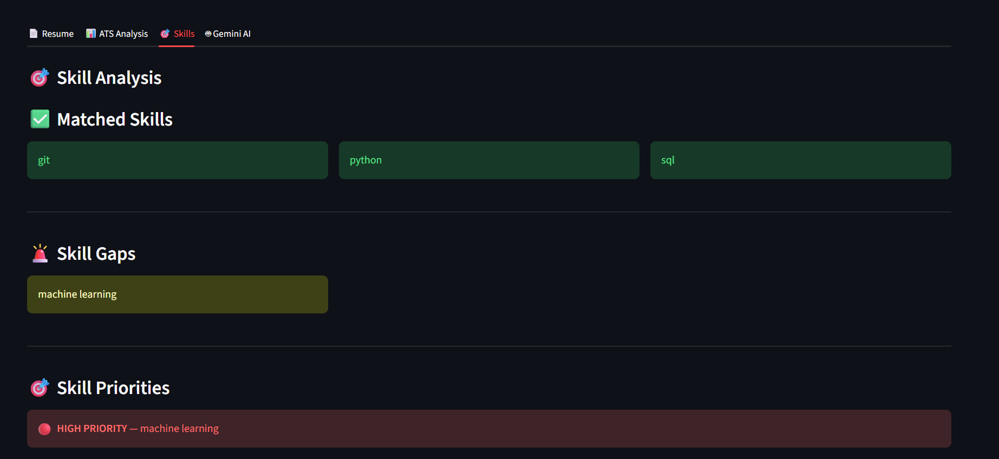
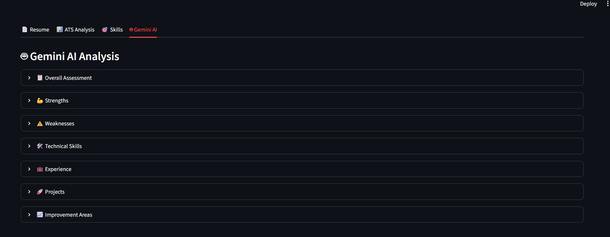

# AI Resume Analyzer

An AI-powered Resume Analyzer and ATS-based Job Matching System that analyzes resumes, evaluates ATS compatibility, identifies skill gaps, and generates AI-powered resume insights.

## Project Overview

AI Resume Analyzer is a full-stack application designed to help candidates understand how well their resume matches a target job description.

The system accepts a PDF resume and a job description, processes the resume through multiple analysis stages, and produces:

- Structured resume information
- Resume validation results
- ATS compatibility score
- Exact skill matching
- Semantic skill matching
- Keyword analysis
- Resume quality analysis
- Skill-gap analysis
- Prioritized skill gaps
- AI-powered resume analysis
- Job-specific recommendations

The project combines traditional NLP techniques, semantic similarity, ATS scoring logic, and Generative AI.

---

## Key Features

### 1. PDF Resume Processing

- Upload resume in PDF format
- Extract text using PyMuPDF
- Clean and normalize extracted text
- Process resume through the analysis pipeline

### 2. Resume Parsing

The system extracts structured information from the resume, including:

- Personal information
- Education
- Experience
- Projects
- Skills

The extracted information is validated and normalized before further analysis.

### 3. Resume–Job Matching

The system compares the resume against a target job description using multiple approaches:

- Exact skill matching
- Keyword matching
- TF-IDF similarity
- Semantic similarity
- Sentence Transformer embeddings

### 4. ATS Analysis

The ATS engine evaluates multiple aspects of the resume:

- Skill matching
- Semantic matching
- Keyword relevance
- Resume quality
- Skill gaps

The results are combined into a final ATS score.

### 5. Skill-Gap Analysis

The system identifies skills present in the job description but missing from the resume.

Skill gaps are also prioritized to help candidates understand which missing skills may require attention.

### 6. Generative AI Analysis

Google Gemini is used to generate AI-powered analysis of the resume and target job description.

The AI analysis includes areas such as:

- Overall assessment
- Strengths
- Weaknesses
- Technical skills
- Experience
- Projects
- Improvement areas
- Job recommendations

### 7. FastAPI Backend

The backend exposes the resume analysis functionality through a REST API.

Main endpoint:

```text
POST /analyze-resume

## Screenshots

### Main Interface

The Streamlit interface allows users to upload a PDF resume and provide a job description for analysis.



### Resume Analysis

Displays the extracted resume profile and detected resume information.



### ATS Analysis

Provides the overall ATS score along with exact skill matching, semantic matching, keyword coverage, and resume quality.



### Skills Analysis

Shows matched skills, identified skill gaps, and prioritized skills.



### Gemini AI Analysis

Provides AI-generated analysis covering overall assessment, strengths, weaknesses, technical skills, experience, projects, and improvement areas.

